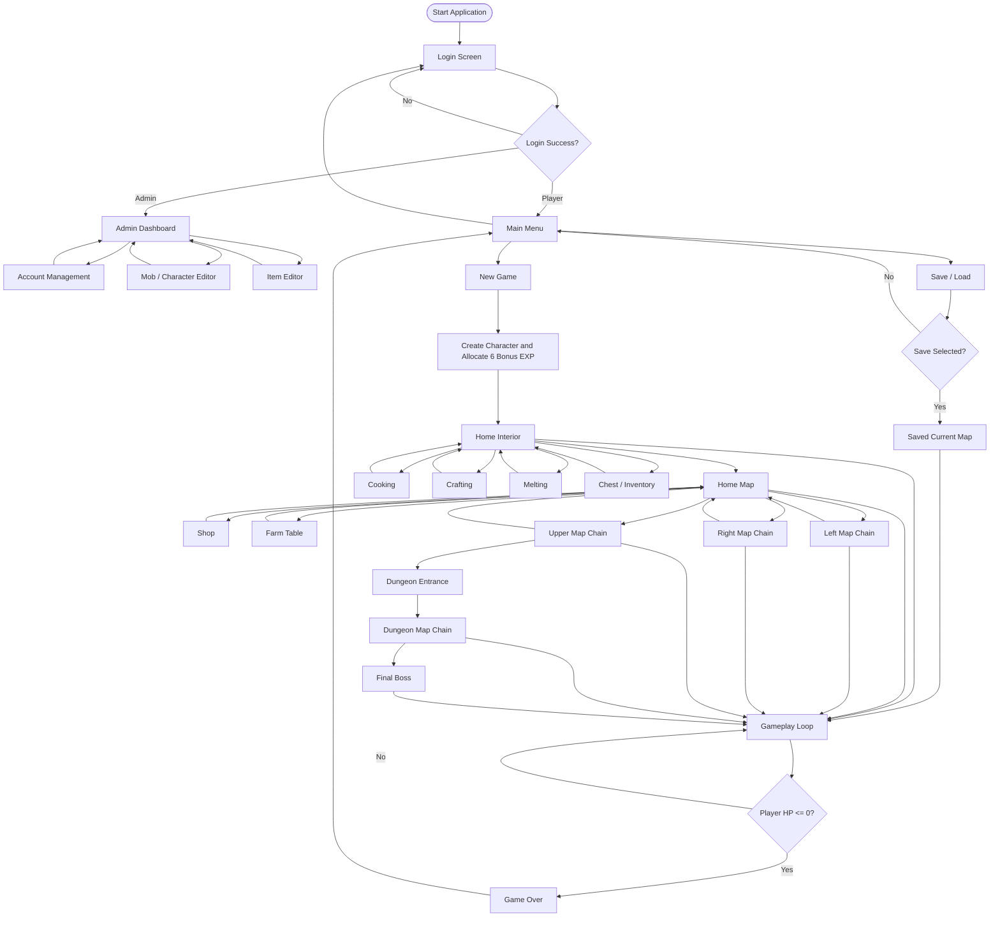
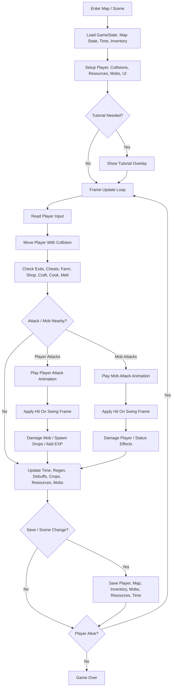
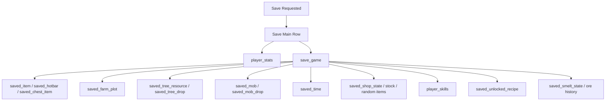

# Rust and Roots Flowchart

## Main Project Flow

```mermaid
flowchart TD
    Start([Start Application]) --> Login[Login Screen]
    Login --> Auth{Login Success?}
    Auth -- No --> Login
    Auth -- Admin --> Admin[Admin Dashboard]
    Auth -- Player --> MainMenu[Main Menu]

    Admin --> AccountMgmt[Account Management]
    Admin --> CharacterEditor[Mob / Character Editor]
    Admin --> ItemEditor[Item Editor]
    AccountMgmt --> Admin
    CharacterEditor --> Admin
    ItemEditor --> Admin

    MainMenu --> NewGame[New Game]
    MainMenu --> SaveLoads[Save / Load]
    MainMenu --> Login

    NewGame --> CreateStats[Create Character and Allocate 6 Bonus EXP]
    CreateStats --> HomeInterior[Home Interior]

    SaveLoads --> LoadSave{Save Selected?}
    LoadSave -- Yes --> CurrentMap[Saved Current Map]
    LoadSave -- No --> MainMenu

    HomeInterior --> HomeMap[Home Map]
    HomeInterior --> Cook[Cooking]
    HomeInterior --> Craft[Crafting]
    HomeInterior --> Melt[Melting]
    HomeInterior --> Chest[Chest / Inventory]

    Cook --> HomeInterior
    Craft --> HomeInterior
    Melt --> HomeInterior
    Chest --> HomeInterior

    HomeMap --> Shop[Shop]
    Shop --> HomeMap
    HomeMap --> FarmTable[Farm Table]
    FarmTable --> HomeMap

    HomeMap --> LeftMaps[Left Map Chain]
    HomeMap --> RightMaps[Right Map Chain]
    HomeMap --> UpperMaps[Upper Map Chain]
    LeftMaps --> HomeMap
    RightMaps --> HomeMap
    UpperMaps --> HomeMap

    UpperMaps --> DungeonEntry[Dungeon Entrance]
    DungeonEntry --> DungeonMaps[Dungeon Map Chain]
    DungeonMaps --> FinalBoss[Final Boss]

    CurrentMap --> GameplayLoop[Gameplay Loop]
    HomeInterior --> GameplayLoop
    HomeMap --> GameplayLoop
    LeftMaps --> GameplayLoop
    RightMaps --> GameplayLoop
    UpperMaps --> GameplayLoop
    DungeonMaps --> GameplayLoop
    FinalBoss --> GameplayLoop

    GameplayLoop --> Death{Player HP <= 0?}
    Death -- No --> GameplayLoop
    Death -- Yes --> GameOver[Game Over]
    GameOver --> MainMenu
```

## Gameplay Loop

```mermaid
flowchart TD
    EnterMap[Enter Map / Scene] --> LoadState[Load GameState, Map State, Time, Inventory]
    LoadState --> SetupSystems[Setup Player, Collisions, Resources, Mobs, UI]
    SetupSystems --> Tutorial{Tutorial Needed?}
    Tutorial -- Yes --> ShowTutorial[Show Tutorial Overlay]
    Tutorial -- No --> Tick
    ShowTutorial --> Tick[Frame Update Loop]

    Tick --> Input[Read Player Input]
    Input --> Movement[Move Player With Collision]
    Movement --> Interactions[Check Exits, Chests, Farm, Shop, Craft, Cook, Melt]
    Interactions --> Combat{Attack / Mob Nearby?}

    Combat -- Player Attacks --> PlayerSwing[Play Player Attack Animation]
    PlayerSwing --> PlayerHit[Apply Hit On Swing Frame]
    PlayerHit --> MobDamage[Damage Mob / Spawn Drops / Add EXP]

    Combat -- Mob Attacks --> MobSwing[Play Mob Attack Animation]
    MobSwing --> MobHit[Apply Hit On Swing Frame]
    MobHit --> PlayerDamage[Damage Player / Status Effects]

    Combat -- No --> WorldUpdate
    MobDamage --> WorldUpdate[Update Time, Regen, Debuffs, Crops, Resources, Mobs]
    PlayerDamage --> WorldUpdate

    WorldUpdate --> SavePoint{Save / Scene Change?}
    SavePoint -- Yes --> Persist[Save Player, Map, Inventory, Mobs, Resources, Time]
    SavePoint -- No --> AliveCheck
    Persist --> AliveCheck{Player Alive?}
    AliveCheck -- Yes --> Tick
    AliveCheck -- No --> GameOver[Game Over]
```

## Database Save Flow

```mermaid
flowchart TD
    SaveRequest[Save Requested] --> MainSave[Save Main Row]
    MainSave --> PlayerStats[player_stats]
    MainSave --> SaveGame[save_game]
    SaveGame --> Inventory[saved_item / saved_hotbar / saved_chest_item]
    SaveGame --> Farm[saved_farm_plot]
    SaveGame --> Resources[saved_tree_resource / saved_tree_drop]
    SaveGame --> Mobs[saved_mob / saved_mob_drop]
    SaveGame --> Time[saved_time]
    SaveGame --> ShopState[saved_shop_state / stock / random items]
    SaveGame --> Skills[player_skills]
    SaveGame --> Recipes[saved_unlocked_recipe]
    SaveGame --> Smelt[saved_smelt_state / ore history]
```
